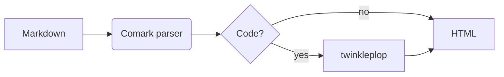

# Feature showcase

This page uses every feature of comarkserv. Edit it while `comarkserv` runs: the page updates in place, and the changed block flashes. :sparkles:

## Code

### Fences with twinkleplop

```ts {2,4} /greet/ [greet.ts]
export function greet(name: string): string {
  const message = `Hello, ${name}!`;
  console.log(message);
  return message;
}

greet("world");
```

```py :line-numbers
from dataclasses import dataclass

@dataclass
class Point:
    x: float
    y: float

    def length(self) -> float:
        return (self.x ** 2 + self.y ** 2) ** 0.5
```

```rust title="main.rs"
fn main() {
    let numbers: Vec<i32> = (1..=10).filter(|n| n % 2 == 0).collect();
    println!("{:?}", numbers);
}
```

```bash
$ comarkserv ./docs --open
$ comarkserv build ./docs --out site
```

Inline code can have a language too: `const answer = 42{:ts}` and `SELECT * FROM users{:sql}`.

### Code groups

::code-group

```bash [pnpm]
pnpm add -g comarkserv
```

```bash [npm]
npm install -g comarkserv
```

```bash [bun]
bun add -g comarkserv
```

::

## Alerts

> [!NOTE]
> GitHub alerts work as on GitHub.

> [!TIP]
> Press <kbd>⌘</kbd> <kbd>K</kbd> or <kbd>/</kbd> to search all pages and headings.

> [!IMPORTANT]
> The grammars load only when a page uses them.

> [!WARNING]
> A fence with an incorrect line range shows an error, not a crash.

> [!CAUTION]
> Dotfiles are not served unless you use `--dotfiles`.

::tip{title="Comark components"}
Comark components such as `::tip`, `::warning` and `::callout` render as alerts too.
::

::details{summary="Click to open"}
Hidden content, with **markdown** in it.
::

## Math

Inline math: $e^{i\pi} + 1 = 0$. Block math:

$$
\int_{-\infty}^{\infty} e^{-x^2} \, dx = \sqrt{\pi}
$$

## Diagrams



## GitHub flavored markdown

| Feature      | markserv | comarkserv |
| ------------ | :------: | :--------: |
| Live reload  |   Page   |   Block    |
| Search       |    No    |    Yes     |
| Static build |    No    |    Yes     |
| Components   |    No    |    Yes     |

- [x] Tables, task lists and ~~strikethrough~~
- [x] Footnotes[^1] and emoji :rocket:
- [ ] Your next feature


[^1]: Footnotes go to the end of the page.
